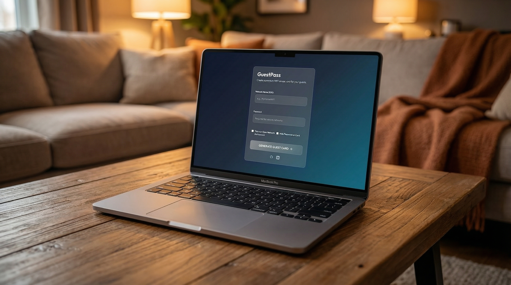

# GuestPass

### The premium way to share your WiFi.

[](https://guest-pass.vercel.app/)
[](LICENSE)



**GuestPass** transforms the mundane task of sharing WiFi credentials into a seamless, elegant experience. No more reading passwords from the back of a router. Just design, generate, and share.

It’s simple. It’s private. It just works.

## Experience

### Privacy by Design.
Your credentials never leave your device. All processing—encryption, QR generation, card rendering—happens locally in your browser. We don't see your password, and neither does anyone else.

### Instant Generation.
Type your network details, and GuestPass instantly creates a high-fidelity QR code. It’s compatible with every modern smartphone camera.

### Premium Aesthetics.
Built with a "Deep Ocean" glassmorphism UI that feels at home on the most premium devices. We believe utility shouldn't compromise on beauty.

## How It Works

1.  **Enter Details** — Input your SSID and Password. All local.
2.  **Customize** — Click directly on the card to edit the text in real-time. Make it yours.
3.  **Share** — Click "Share Image" to send a digital copy, or "Print PDF" for a physical card.

## Quick Start

Run it locally in seconds. No complex dependencies.

```bash
# Clone the repository
git clone https://github.com/ob-cheng/Guest-Pass.git

# Enter directory
cd Guest-Pass

# Open index.html in your browser
open index.html
```

## Tech Stack

*   **HTML5 & Tailwind CSS** — For structure and modern, fluid styling.
*   **Vanilla JavaScript** — For lightning-fast performance without framework bloat.
*   **QRCode.js** — For reliable, standards-compliant code generation.
*   **html2canvas** — For pixel-perfect export.

---


